<html>
  <head>
    <meta charset="UTF-8">
    <title>UNDERTALE</title>
	 <!--favicon*-->
	<link rel="apple-touch-icon" sizes="57x57" href="img/favicon/apple-icon-57x57.png">
	<link rel="apple-touch-icon" sizes="60x60" href="img/favicon/apple-icon-60x60.png">
	<link rel="apple-touch-icon" sizes="72x72" href="img/favicon/apple-icon-72x72.png">
	<link rel="apple-touch-icon" sizes="76x76" href="img/favicon/apple-icon-76x76.png">
	<link rel="apple-touch-icon" sizes="114x114" href="img/favicon/apple-icon-114x114.png">
	<link rel="apple-touch-icon" sizes="120x120" href="img/favicon/apple-icon-120x120.png">
	<link rel="apple-touch-icon" sizes="144x144" href="img/favicon/apple-icon-144x144.png">
	<link rel="apple-touch-icon" sizes="152x152" href="img/favicon/apple-icon-152x152.png">
	<link rel="apple-touch-icon" sizes="180x180" href="img/favicon/apple-icon-180x180.png">
	<link rel="icon" type="image/png" sizes="192x192"  href="img/favicon/android-icon-192x192.png">
	<link rel="icon" type="image/png" sizes="32x32" href="img/favicon/favicon-32x32.png">
	<link rel="icon" type="image/png" sizes="96x96" href="img/favicon/favicon-96x96.png">
	<link rel="icon" type="image/png" sizes="16x16" href="img/favicon/favicon-16x16.png">
	<link rel="manifest" href="/manifest.json">
	<meta name="msapplication-TileColor" content="#ffffff">
	<meta name="msapplication-TileImage" content="/ms-icon-144x144.png">
	<meta name="theme-color" content="#ffffff">
	 <!-------------------------------------------------------------------------->
	
	
	
    
	<link rel="stylesheet" type="text/css" href="css/bootstrap.min.css">
	<link rel="stylesheet" type="text/css" href="css/style.css">
	
  </head>
  <body>
	  
	 <audio id="bgm">
		  <source src="audio/mus_toriel.ogg" type="audio/ogg">
		  Your browser does not support the audio element.
	  </audio>
	  
	  <audio id="bgm2">
		  <source src="audio/mus_story.ogg" type="audio/ogg">
		  Your browser does not support the audio element.
	  </audio>
	  
	  <audio id="bgm3">
		  <source src="audio/mus_menu.ogg" type="audio/ogg">
		  Your browser does not support the audio element.
	  </audio>
 	  

-

+

sfx

 
FOR A BETTER EXPERIENCE PLEASE TURN ON THE AUDIO 

 
LOADING

 <a id="play">START</a>
 
.<b id="punti"></b>

	
	

			

				

			

			
*

		

		
click

	  

	  		
	  
	   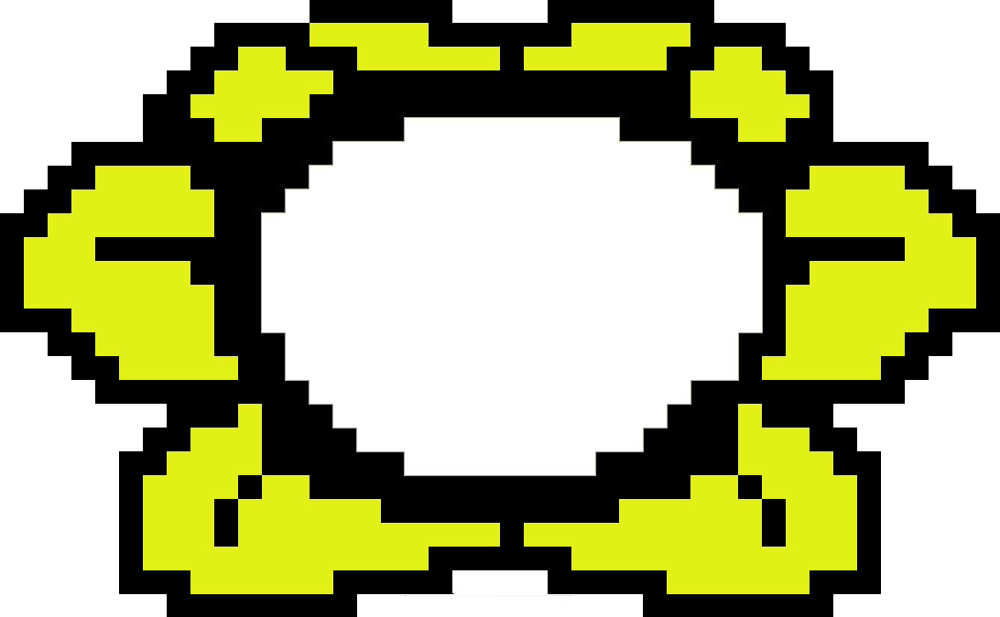
	   
	   
	   

	  

	
	

	  

	

	

	 	  
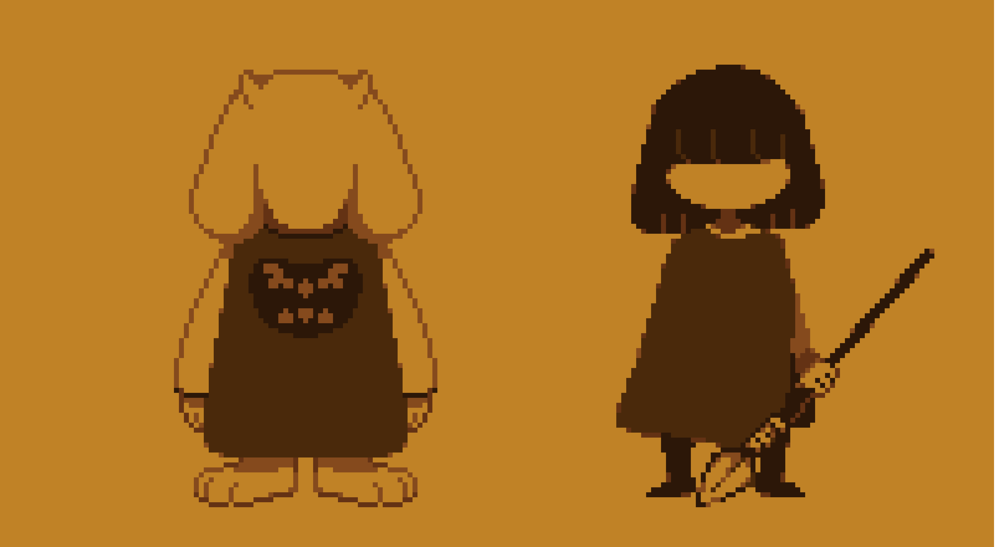

	

	 

	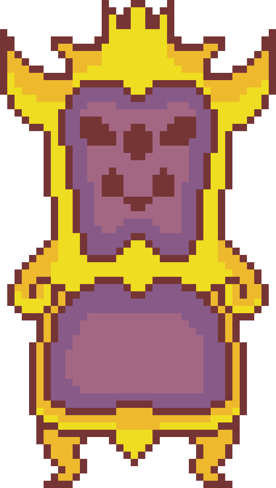
	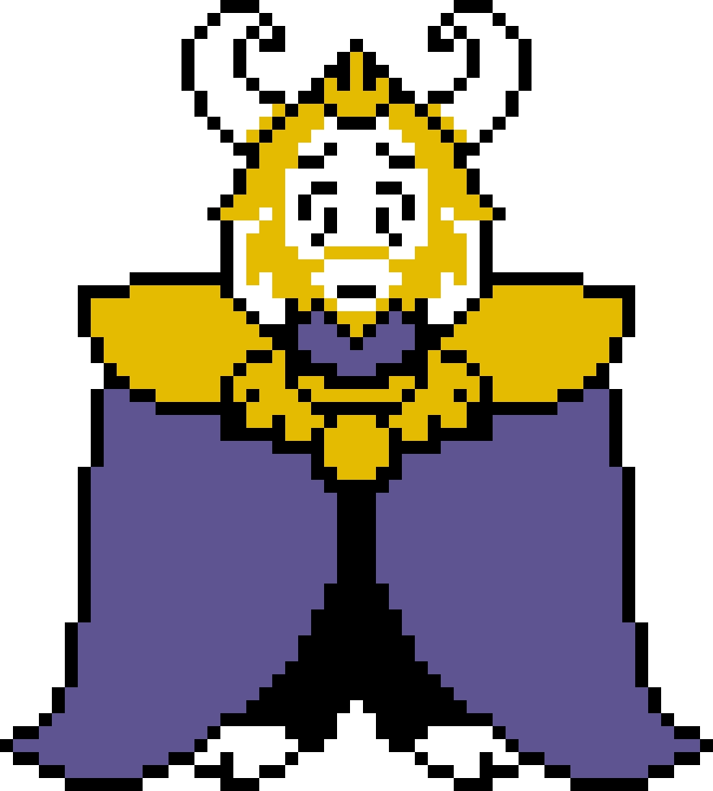

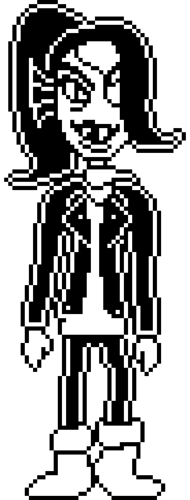
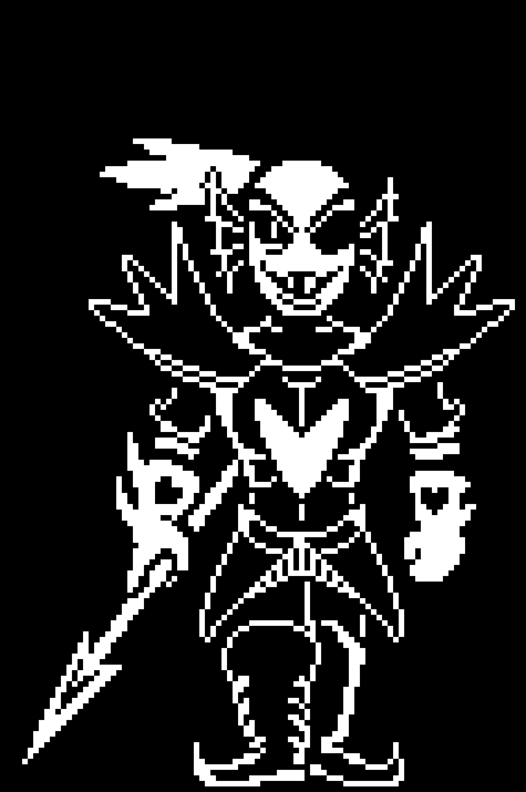

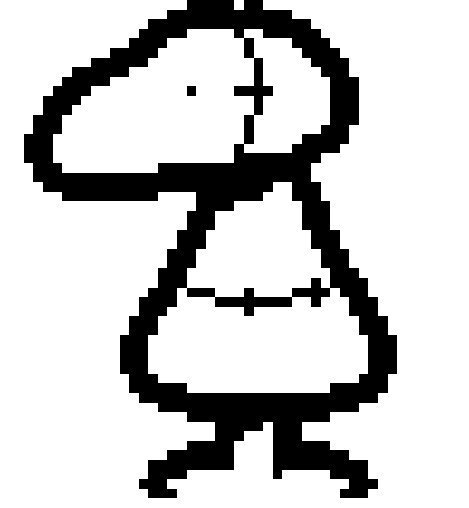
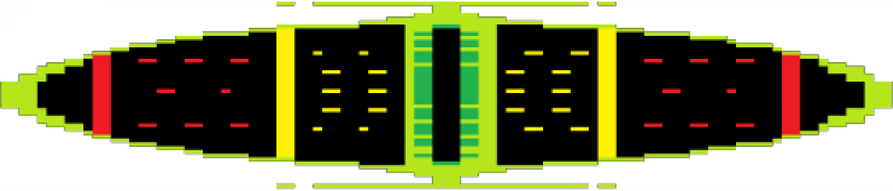
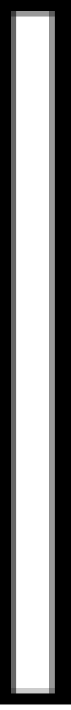
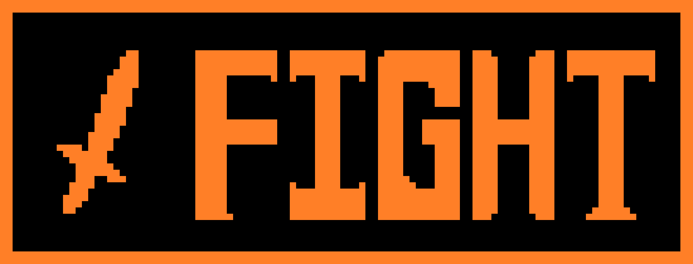

	  

click

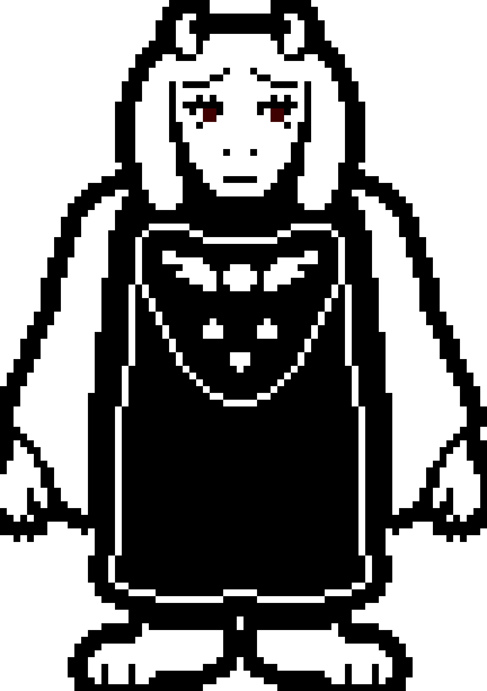

	  

<a id="reset">Reset</a> 
and make a new choice 
or 
Buy the game
<ul>
<li><a href="https://store.steampowered.com/app/391540">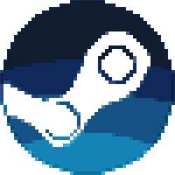</a></li>
<li><a href="https://www.nintendo.com/games/detail/undertale-switch">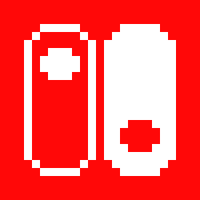</a></li>
<li></li>
<li></li>
</ul>

	  

	
	 
	  

	
	
  </body>
</html>
